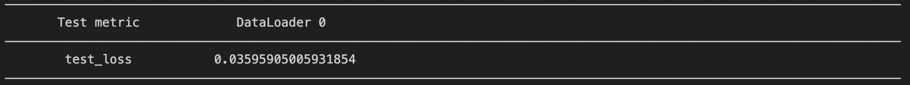
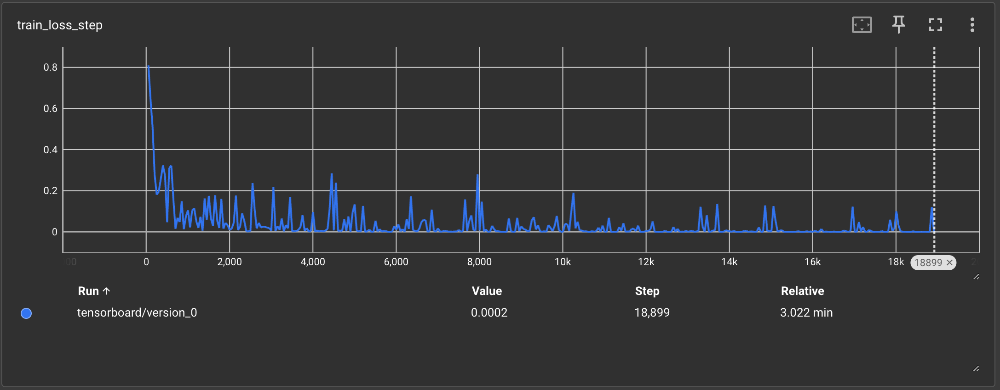
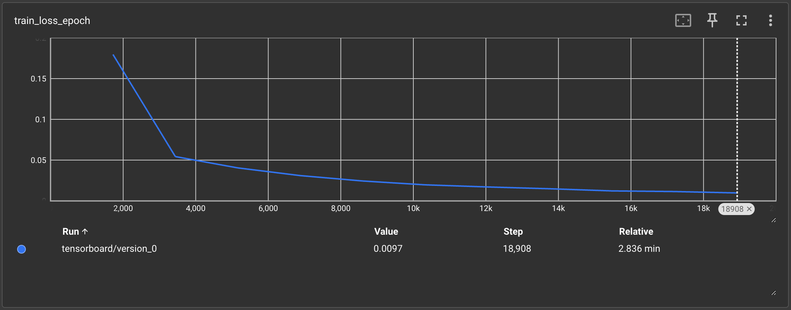
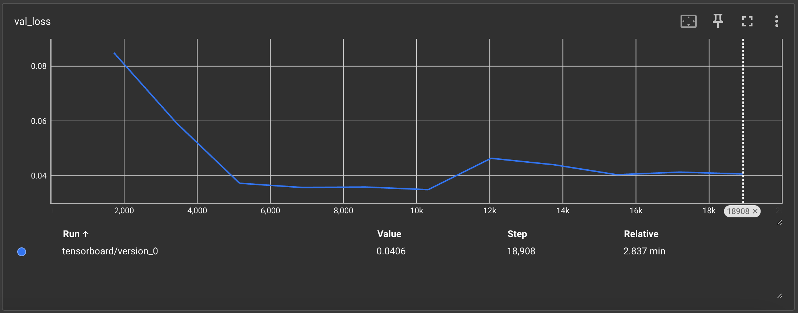
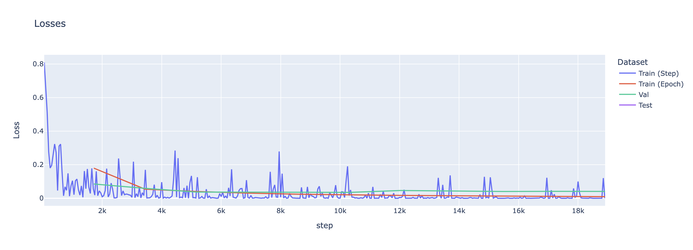

# Lightning Blog Post

Pytorch Lightning is a PyTorch wrapper for high-performance AI research built on top of PyTorch. Lightning abstracts a lot of the boilerplate code that would normally have to be writen in PyTorch. It also provides a lot of pre-built functionalities that can be used to train models. In this blog post, it will be discussed how to use PyTorch Lightning to train, validate and test of deeplearning models.

## Installation

To install PyTorch Lightning, you can use pip:

```bash
pip install lightning
```

## Usage

*Lightning* has many functionalities that can be used either to train, validate, test or even optimize models. The main classes that are used in *Lightning* are the model class and the trainer class. The model class is where the architecture of the model is defined, and the trainer class is where the training process is defined. So, for convenience, this blog will structure the explanation of the *Lightning* framework in two parts: the model and the trainer.

## Model

The model class is where the architecture of the model is defined. It is a subclass of `L.LightningModule`. The model class should have the following methods:

- `__init__`: As any class, the model class should have an `__init__` method. This is where the model is defined.
- `training_step`: This is where the training step is defined. It should return the loss.
- `configure_optimizers`: This is where the optimizer is defined.
- `forward`: This is where the forward pass is defined. (Recommended, but not required)

This methods are the minimum required to train a model with *Lightning*, `training_step` is required to get the loss and `configure_optimizers` is required to define the optimizer, so that the trainer can update the model. Therefore the basic model class should look like this:

```python
class Model(LightningModule):
    def __init__(self):
        super(Model, self).__init__()
        # Define the model here

    def training_step(self, batch, batch_idx):
        # Define the training step here
        return loss

    def configure_optimizers(self):
        # Define the optimizer here
        return optimizer
```

Ths methods are required so that lightning can implement the functionality of the following pseudo code:

```python
# enable gradient calculation
torch.set_grad_enabled(True)

for batch_idx, batch in enumerate(train_dataloader):
    loss = training_step(batch, batch_idx)

    # clear gradients
    optimizer.zero_grad()

    # backward
    loss.backward()

    # update parameters
    optimizer.step()
```
Extracted from [Lightning Documentation](https://lightning.ai/docs/pytorch/stable/common/lightning_module.html)


The model class can have other methods, a few examples are:
- Other Forward Passes: 
    - `validation_step`: This is where the validation step is defined. It should return the loss.
    - `test_step`: This is where the test step is defined. It should return the loss.
    - `predict_step`: This is where the prediction step is defined. It should return the prediction.

- Dataloaders:
    - `train_dataloader`: This is where the training dataloader is defined.
    - `val_dataloader`: This is where the validation dataloader is defined.
    - `test_dataloader`: This is where the test dataloader is defined.

- Callbacks (methods that are called at different points of the training process):
    - on_fit_start
    - on_train_start
    - on_train_end
    - on_fit_end
    - on_train_epoch_start
    - on_train_batch_start
    - on_before_batch_transfer
    - on_after_batch_transfer
    - on_before_zero_grad
    - on_before_backward
    - on_after_backward
    - on_before_optimizer_step
    - on_train_batch_end
    - on_train_epoch_end
    - on_validation_model_eval  
    - on_validation_start
    - on_validation_epoch_start
    - on_validation_batch_start
    - on_before_batch_transfer
    - on_after_batch_transfer
    - validation_step
    - on_validation_batch_end
    - on_validation_epoch_end
    - on_validation_end
    - on_validation_model_train 

- Logging (altgough these generally are not implemented in the model class, they can be called from it)
    - `log`
    - `log_dict`
    - `log_image`
    - `log_metrics`

- Optimizers:
    - `optimizer_step`
    - `optimizer_zero_grad`
    - ...

There are many more methods that can be implemented in the model class such as `prepare_data`, `setup`, `teardown`... For a full list of methods that can be implemented in the model class, check the [Lightning Documentation](https://lightning.ai/docs/pytorch/stable/common/lightning_module.html).


## Trainer

`lightning.Trainer` is the class that is used to train the model. Contrary to the model class, the trainer is already implemented in *Lightning*. It is a class that is instantiated in the main script and is used to train the model. The trainer class has many arguments that can be used to customize the training process. Yet, none of them are required. The basic usage of the trainer is to instantiate it and call the `fit` method. The `fit` method takes the model and the dataloaders as arguments. The basic usage of the trainer is as follows:

```python
model = Model()
trainer = Trainer()
trainer.fit(model)    # Consider that train_dataloader is defined in the model class
```

This code defines the model, defines the trainer and then trains the model in 3 lines of code! The trainer not only trains the model, but also saves any metric logged by the model and checkpoints of the model being trained. If the a validation dataloader is supplied to the trainer, either in the `fit` method or in the model class, it will also validate the model at the end of each epoch. The trainer can also be used to test the model and predict with the model. The trainer can also be used to resume training from a checkpoint. For a full list of arguments that can be passed to the trainer, check the [Lightning Documentation](https://lightning.ai/docs/pytorch/stable/common/trainer.html).


## Example

For the following part consider the following imports:

```python
import torch
import torch.nn             as nn
from torch.utils.data       import DataLoader, random_split
from torchvision            import transforms
from torchvision.datasets   import MNIST

import lightning                    as     L
from   lightning.pytorch.callbacks  import EarlyStopping
from   lightning.pytorch.callbacks  import TQDMProgressBar, ModelCheckpoint
from   lightning.pytorch.loggers    import TensorBoardLogger, CSVLogger
```

To exemplify the usage of *Lightning*, a simple model will be trained to classify the MNIST dataset. The model will be a convolutional neural network with 4 convolutional layers, 2 pooling layers and 2 fully connected layers. The model will be trained for 10 epochs. The model will be defined in the following way:

```python
class ConvNet(L.LightningModule):
    def __init__(self):
        super(ConvNet, self).__init__()
        self.model = nn.Sequential(
            nn.Conv2d(1, 32, 3, 1),             # 28x28 -> 32x26x26
            nn.ReLU(),
            nn.MaxPool2d(2),                    # 32x26x26 -> 32x13x13
            nn.Conv2d(32, 64, 3, 1),            # 32x13x13 -> 64x11x11
            nn.ReLU(),
            nn.MaxPool2d(2),                    # 64x11x11 -> 64x5x5
            nn.Conv2d(64, 128, 3, 1),           # 64x5x5 -> 128x3x3
            nn.ReLU(),
            nn.Conv2d(128, 256, 3, 1),          # 128x3x3 -> 256x1x1
            nn.ReLU(),
            nn.Flatten(),                       # 256x1x1 -> 256
            nn.Linear(256, 128),                # 256 -> 128
            nn.ReLU(),
            nn.Linear(128, 10),                 # 128 -> 10
        )
        self.criteria = nn.CrossEntropyLoss()
        mnist_dataset = MNIST(root='.', train=True, download=True, transform=transforms.ToTensor())
        self.train_dataset, self.val_dataset = random_split(mnist_dataset, [55000, 5000])
        self.test_dataset = MNIST(root='.', train=False, download=True, transform=transforms.ToTensor())

    def forward(self, x):
        return self.model(x)

    def _common_step(self, batch, batch_idx):
        x, y = batch
        y_hat = self(x)
        return y_hat, self.criteria(y_hat, y)

    def training_step(self, batch, batch_idx):
        y_hat, loss = self._common_step(batch, batch_idx)
        self.log('train_loss', loss, on_step=True, on_epoch=True, prog_bar=True, logger=True)
        return loss

    def configure_optimizers(self):
        return torch.optim.Adam(self.parameters(), lr=0.001)
    
    def validation_step(self, batch, batch_idx):
        y_hat, loss = self._common_step(batch, batch_idx)

        self.log('val_loss', loss)
        return loss

    def test_step(self, batch, batch_idx):
        y_hat, loss = self._common_step(batch, batch_idx)
        self.log('test_loss', loss)
        return loss
    
    def train_dataloader(self):
        return DataLoader(self.train_dataset, batch_size=32, num_workers=10, shuffle=True)
    
    def val_dataloader(self):
        return DataLoader(self.val_dataset,   batch_size=32, num_workers=10, shuffle=False, persistent_workers=True)

    def test_dataloader(self):
        return DataLoader(self.test_dataset,  batch_size=32, num_workers=10, shuffle=False, persistent_workers=True)
```

This model implements not only the mandatory methods, but also methods to get the dataloaders, validate and test the model. It also calls the `log` method to log the loss. The model can be trained with the following code:

```python
model = ConvNet()
trainer = Trainer(max_epochs=10)
trainer.fit(model)
```

Yet one of the main advantage of *Lightning* is abstracts not only the training process, but also many other functionalities. For example, the model can be trained with a progress bar, early stopping, tensorboard logging and model checkpointing with the following code:

```python
model = ConvNet()
trainer = L.Trainer(
            max_epochs=100, enable_progress_bar=True, devices=1,
            callbacks=[
                EarlyStopping(monitor="val_loss", patience=5), 
                TQDMProgressBar(refresh_rate=10),
                ModelCheckpoint(filename='{epoch}_{step}_{val_loss:.4f}_val_acc={val_acc:.4f}', save_top_k=3, monitor='val_loss')
                ],
            logger=[
                CSVLogger(        "logs/", name='csv/'),
                TensorBoardLogger("logs/", name='tensorboard/'),
                ]
            )
trainer.fit(model)
```

Passing such arguments to the trainer not only allows to implement functionalities such as early stopping, but also organizes files or reducing the ProgressBar refresh rate so it becomes more readable.

After training the model, the model can be tested with the following code:

```python
trainer.test()
```
This allows to get the test loss and any other metric that was logged during the training process. It also automatically loads the best model checkpoint, so that the model that is tested is the best model that was trained.




## Tensorboard
With the tensorboard logger, the training process can be visualized in tensorboard. To visualize the training process in tensorboard, run the following command in the terminal:

```bash
tensorboard --logdir logs/tensorboard/
```

This will start a tensorboard server that can be accessed in the browser at `localhost:6006`. In the example run, the following graphs were generated:





Since `CSVLogger` was also used, the training process can also manually be visualized by reading the csv files that were generated. The csv files are saved in the `logs/csv/version_<number>` directory. The following code can be used to visualize the training process:

```python
import pandas as pd
import plotly.express as px

df                  = pd.read_csv("logs/csv/version_0/metrics.csv")
train_losses_step   = df[df['train_loss_step' ].notna()].copy()
train_losses_epoch  = df[df['train_loss_epoch'].notna()].copy()
val_losses          = df[df['val_loss'        ].notna()].copy()
test_losses         = df[df['test_loss'       ].notna()].copy()

train_losses_step['Dataset']  = 'Train (Step)'
train_losses_epoch['Dataset'] = 'Train (Epoch)'
val_losses['Dataset']         = 'Val'
test_losses['Dataset']        = 'Test'

train_losses_step['Loss']    = train_losses_step['train_loss_step']
train_losses_epoch['Loss']   = train_losses_epoch['train_loss_epoch']
val_losses['Loss']           = val_losses['val_loss']
test_losses['Loss']          = test_losses['test_loss']

df = pd.concat([train_losses_step, train_losses_epoch, val_losses, test_losses])
fig = px.line(df, x='step', y='Loss', color='Dataset', title='Losses').show()
```


In this case, the process is considerably more manual than using tensorboard, but it comes to show that you can have varying levels of control with *Lightning*.

## Conclusion

In this blog post, it was discussed how to use PyTorch Lightning to train a model. It was shown how to define a model class and a trainer class, and how to train a model with them. It was also shown how to use some of the functionalities that *Lightning* provides, such as early stopping, model checkpointing, tensorboard logging and csv logging. It was also shown how to visualize the training process with tensorboard and with csv files. *Lightning* is a very powerful tool that can be used to train models in a very efficient way. It abstracts a lot of the boilerplate code that would normally have to be written in PyTorch, and provides a lot of functionalities that can be used to train models. It is a very useful tool that can be used to train models in a very efficient way.

Example code used in this blog can be found at [this repository](https://github.com/ArthurSBianchessi/DL2_Blog2)